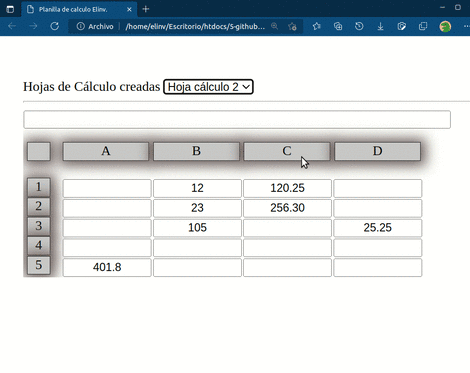

# Hojas de cáculos Elinv

## Tabla de contenido

- [Solo en Javascript, Html y Css](#1)
- [De Integración fácil en cualquier pagina web](#2)
- [Permite parentesis y aplicación de símbolos matemáticos + - / * %](#3)
- [Crear una planilla a medida para cada caso](#4)

---

## Codigo explicado linea a linea 

Se puede definir la cantidad de filas y columnas, como así el tamaño de las celdas.

## La edición es de facil intuición

Para quién conoce de planilla de cáculos, pues sigue los mismos parámetros.

---

## 	Demo

---

# A futuro

Estaba pensando en agregar una opción suma, 
marcando con el puntero del mouse, 
varias celdas a la vez.

Y que al copia una formula se traslade la relación de celdas.

Menu contextual para grabar la planilla actual o rescatarla.

Presionando las teclas "insert" se copia la celda actual y con "Supr" se pega.

Observarán que así copien la celda viendo el resultado, también se copia la formula 
si bien la relación es siempre hacia las mismas celdas de origen. (Por ahora)

Para evitar la colisión con Ctrl + C y Ctrl + V.

La ayuda se produce mediante un cartel de color rojo, ante los posibles errores.

En la celda editada si se ha alterado la formula, 
no desesperen, simplemente presionan F2 y rescata la formula original en esa celda.

Si colocan un número equis en una celda, y desean guardala ante posibles borrados, 
presionan F2, y automáticamente esa celda guarda ese número por si quisieran volver a el.

Prueben a escribir un número en una celda, presionen F2, luego borren ese número e ingresen otro, y presionen nuevamente F2, aparecerá inmediatamente el número anterior.

Esta posibilidad no la tienen las hojas de cálculo tradicionales.

---

- Cualquier duda que tengan la dirigen a elinv.elinv@gmail.com.

-  🛠️ Errores, sugerencias, ideas, envialas a nuestro mail: <elinv.elinv@gmail.com>

- Ver info de Elinv en Google Search:  
<a href="https://www.google.com.ar/search?q=elinv">
   Enlace a la info de Elinv  -> en Google Search
</a>

- 👍 Saludos!

- Atte.

# Elinv.

